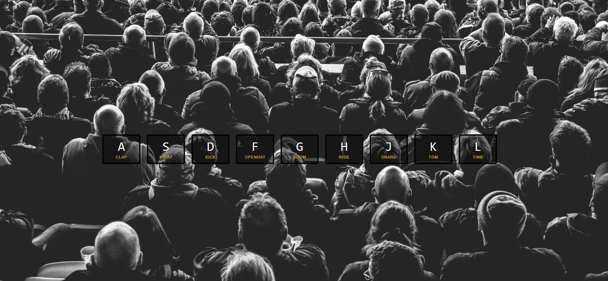


# Drum kit

### 摘要

0. 有別於作者原始碼，一開始透過 `Javascript組字串` 方式載入DOM
1. 起手式 : 針對鍵盤事件進行監聽
```js
window.addEventListener('keydown', keyHandler);
```

2. 實作將 `撥放音樂` 以及 `畫面特效` 綁定再一起   
3. 透過 `audio.currentTime = 0` 使音效可以在迅速點及之下正常播放而不延遲  
4. 掌握何時要加入觸發時該有的動畫以及何時該收回(移除)動畫
5. 針對 key class 做的動畫屬性有很多，那 transitioned 會因此進行多次的重複觸發，所以縱使指監聽一次還是會重複觸發，因此透過 `event.propertyName == 'transform'` 這一項屬性進行監聽綁定即可。


### 代辦項目

1. Record Audio and Replay 

