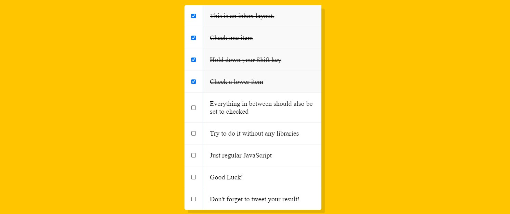

# Hold Shift and Check Checkboxes

### 摘要

0. 題目概述 : 鍵盤 、 滑鼠事件的 搭配使用 (假如有 10 個 checkbox , 那我點了第 2 個以後 按住shift 不放 再點擊第 6 個 , 則此時會把 2~6 中間的一併選取)
1. 與作者作法不一樣 , 將使用 slice 來做區段上的選取。所以 首先要在 checkbox 的監聽上 使用 `Array.from` 來把 querySelectorAll 轉換成完整的陣列 。
2. 當 `click 事件` 的 `shiftKey` 為 true 時即表示 使用者是按著 shift + 點擊 滑鼠左鍵 。  
3. slice 搭配 Math.min 和 Math.max 來判斷 , 因為我們不能說準使用者是從上到下 勾選 , 或是下到上。
    ```js
    .slice(
        Math.min(nowCheck,lastCheck),  // 找出兩者較小的
        Math.max(lastCheck,nowCheck)   // 找出兩者較大的
    )
    ```